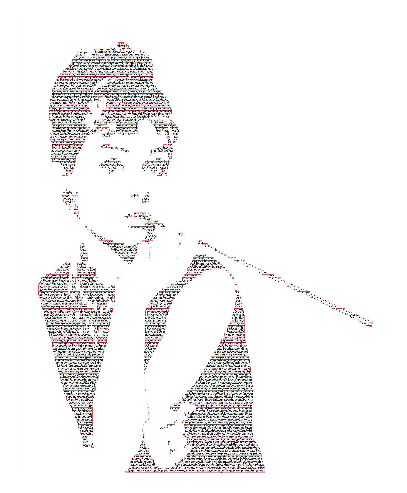

<!-- README.md is generated from README.Rmd. Please edit that file -->

```{r, include = FALSE}
knitr::opts_chunk$set(
  collapse = TRUE,
  comment = "#>"
)
```

# Image from text

## Intro
* I have been intermittently working on this project to recreate images from continuous text strings for some time 
* This is a summary of where I got to having (sort of) achieved it using R
* It's **slow and inefficient with known (and unknown!) bugs**
* I wanted to document it and share it in its current state as it might be a fun project to collaborate on
  * If you are interested in contributing or enhancing this project - please let me know!
```{r warning=FALSE, message=FALSE}
library(tidyverse)
library(sf)
library(grid)
library(magick)
```

## Input variables
* As there are so many inputs - I've put them all here at the start for convenience
* To summarise the main inputs
  * Provide a path/URL to an image and whether you want the text to be placed in the dark or light areas of the image
  * A threshold value for which pixels of the image are considered dark and which pixels are considered light
  * The desired output width in inches (this will then have any border size added to it)
  * A bunch of different colour parameters for text, background fills etc
  * The font size (in points) and font spacing/font face details
```{r}
# Input image options
i <- 'https://images.photowall.com/products/59144/audrey-hepburn-in-breakfast-at-tiffanys-1.jpg?h=699&q=85'
black_white_threshold <- 0.5 # below threshold is dark, above is light
text_in_dark <- TRUE # Should text be placed in dark or light area of image?
size <- 500 # resize original image to this many pixles wide (just to make it more managable for testing)
image_buffer_pcnt <- -0.075 # percentage of output_w

# Output image options
output_w <- 14 # chosen image width in inches
background_fill <- "white"
border_percent <- 10 # percent of output_w
border_fill <- "white"
border_line_col <- "black"
border_line_sizes <- 0.5 # applies to page border and textbox border
page_bleed_pcnt <- 0.5

# Text options
font_size_point <- 5
font_face <- "bold" # "plain", "bold", "italic", "oblique", and "bold.italic"
font_col <- "black"
text_box_fill <- "transparent"
text_box_col <- "red"
line_breathing_space <- 0.85
```

## Read input image
* Read and resize image
* Compute new variables required for the output based on the dimensions of the resized input image
```{r out.width="40%"}
i <- image_read(i) |> image_resize(paste0(size, "x"))

info <- image_info(i)
w <- info$width
h <- info$height
ar <- h/w
output_h <- output_w * ar # compute output height in inches
i
```

## Process image
* Convert the image to `{sf}` polygons (via a `{stars}` raster)
* The image is converted to greyscale values with a range between 0 (black) and 1 (white)
* The greyscale value is then converted to binary (0 = black, 1 = white) based on the `black_white_threshold` value
```{r}
i_sf <- 
    i |> 
    image_convert(type = "grayscale") |>
    image_flip() |>
    image_raster() |>
    mutate(
        x = scales::rescale(x, to = c(0, output_w)),
        y = scales::rescale(y, to = c(0, output_h)),
        col2rgb(col) |> t() |> as_tibble(),
        col = scales::rescale(red, to = c(0,1)), # 0 is dark, 1 is light
        col = case_when(col > black_white_threshold ~ 1, TRUE ~ 0)) |> 
    select(x, y, col) |> 
    stars::st_as_stars() |> 
    st_as_sf(as_points = FALSE, merge = TRUE) |> 
    st_make_valid() |> 
    st_set_agr("constant")
```

* Extract the polygons of the black (or white) polygons based on the value of `text_in_dark`
  * If `TRUE` the black polygons are extracted and the textboxes will be placed inside them
* Reduce or increase the size of the area that textboxes will go in by applying a negative or positive `image_buffer_pcnt`
```{r}
box_area <- i_sf |> filter(col == ifelse(text_in_dark, 0, 1)) |> st_combine() 
box_area_buffered <- 
    box_area |> 
    st_buffer((output_w/100)*image_buffer_pcnt, endCapStyle = "FLAT")
```

## Create textboxes
* The textboxes are created by generating regularly spaced LINESTRINGs that span the width of the image
  * The spacing between the LINESTRINGs is the font size (converted to inches using a value of 72.27 points per inch) 
* The spatial intersection of the LINESTRINGs and the `box_area_buffered` polygons is computed with each intersection being buffered to the full text height. Then all MULTIPOLYGONs are split out to be POLYGONs
* This technique is a bit quick and dirty and could certainly be improved. It will approximate the image, but will certainly miss bits and create unwanted artefacts
* I also create the grob boxes in this step. The boxes aren't actually needed when it comes to fitting the text, but I find it helps to be able to visualise them for debugging purposes
* Note that my hack to arrange the textboxes top-to-bottom and left-to-right is to order by their top `t` value descending first and their by their left `l` value
  * I had to round the `t` value so all boxes on the same line are considered exactly the same height
```{r}
font_size_inches <- (font_size_point/72.27)*line_breathing_space # point

ls <- 
    seq(
        from = output_h-(font_size_inches/2), 
        to = 0+(font_size_inches/2), 
        by = -font_size_inches) |> 
    map(~st_linestring(matrix(c(0, .x, output_w, .x), ncol = 2, byrow = TRUE))) |> 
    st_sfc() |> 
    st_intersection(box_area_buffered) |> 
    st_buffer(font_size_inches/2, endCapStyle = "FLAT") |>
    st_cast("MULTIPOLYGON") |> 
    st_cast("POLYGON") |> 
    st_as_sf() |> 
    mutate(
        bbox = map(x, st_bbox),
        l = map_dbl(bbox, ~.x[1]),
        b = map_dbl(bbox, ~.x[2]),
        r = map_dbl(bbox, ~.x[3]),
        t = map_dbl(bbox, ~.x[4])) |>
    arrange(desc(round(t, 10)), l) |>
    mutate(
        rn = row_number(),
        box_width = r - l,
        box_height = t - b,
        box_grob = 
            pmap(
                .l = list(l, b, box_width, box_height), 
                .f = ~rectGrob(
                    x = ..1, 
                    y = ..2, 
                    width = ..3, 
                    height = ..4, 
                    just = c(0,0),
                    default.units = "inches",
                    gp = gpar(col = text_box_col, 
                              lwd = border_line_sizes, 
                              fill = text_box_fill))))|> 
    select(-bbox) |> 
    rename(geom = x)
```

* Visualise what the textbox fitting code has done
* It's clear how there are unwanted artefacts where the LINESTRING spacing has happened to miss a key bit of the image, or where the buffering extends a textbox beyond the boundary of the image area. This is somehting that will need improving.
```{r fig.width=6, fig.height=6}
ggplot() +
    geom_sf(data = i_sf, col = NA, fill = NA) +
    geom_sf(data = box_area, col = NA, fill = 2) +
    geom_sf(data = ls$geom, fill = NA, col = 1) +
    coord_sf(xlim = c(2,6), ylim = c(10, 14))
```

## Create text string
* Make the text vector that I want to create the image with
  * Here I have used `sentences` from the `{stringr}` package and combined them all with a space at the end
  * Testing this code with actual sentences makes it easier to visually check that the text is being chopped up as expected 
* Extract the unique characters that are used in this text string
```{r}
s <- paste0(sentences, " ") |> paste0(collapse = "")
all_chars <- str_split_1(s, "")
unique_chars <- unique(all_chars)
```

* Compute the size of the border and bleed margin in inches
* Compute the dimensions `out_w` and `out_h` of the final output page
```{r}
page_border_inches <- (output_w/100) * border_percent
page_bleed_inches <- (output_w/100) * page_bleed_pcnt

out_w <- output_w + page_border_inches + page_bleed_inches
out_h <- output_h + page_border_inches + page_bleed_inches
```

## Initialise graphics device and draw text image
* This is the involved drawing step
* Initialise the `png()` graphics device to start recording the image. Outside of this demo, it may be better to use `pdf()`.
  * I learnt how to use these `{grid}` functions as I was developing this code so it's very likely that I am doing this in an inefficient or improper way. I would love to hear if there is a better way to do this
* The first few bits of code initialise the graphics device and draw the page and textbox
* The rest of the code iterates through the textboxes, working out which bits of the text string will fit in them
  * It tries to be clever about handling character spaces. For example, no textbox should start or end with a character space
  * And it also tries to spread out the letters so they are justified to both the left and right hand side of the textbox (these additional computations make it frustratingly slow)
  * Hopefully the comments in the code will explain my approach and reasoning
```{r}
# Initialise device
png('output.png', width = out_w, height = out_h, units = "in", res = 300,  bg = border_fill)

# Create viewport for drawing
grid.newpage()
pushViewport(
    viewport(
        x = out_w/2,
        y = out_h/2,
        width = output_w, 
        height = output_h,
        xscale = c(0, output_w),
        yscale = c(0, output_h),
        default.units = "inches",
        gp = gpar(fontsize = font_size_point, cex = 1, fontface = font_face)))

# Add rectangle of the plotting area which can be filled with colour or given a border
grid.rect(x = output_w/2,
          y = output_h/2,
          width = output_w, 
          height = output_h,
          default.units = "inches",
          gp = gpar(fill = background_fill, col = border_line_col, lwd = border_line_sizes))

# Draw each textbox
map(ls$box_grob, grid.draw) |> invisible()

# Create a lookup of each unique character in the text and its width on the current device
lu <- 
    map_dbl(
        .x = unique_chars, 
        .f = ~convertWidth(grobWidth(textGrob(.x)), "inches")) |> 
    set_names(unique_chars)

# Create a vector of the width of every character in the text and its minimum value
char_widths <- lu[all_chars] |> unname()
min_char_width <- min(char_widths)
n_chars <- length(char_widths)

# Now iterate through the textboxes
start <- Sys.time()
for(i in 1:nrow(ls)){
    
    # If no text left, stop loop
    if(length(char_widths) == 0) break
    
    # Indices of all letters that will fit in this textbox
    char_selection <- which(cumsum(char_widths[1:ceiling(ls$box_width[i]/min_char_width)]) <= ls$box_width[i])
    
    # If no letters fit, go to next textbox
    if(length(char_selection) == 0) next
    
    # Text characters for this iteration
    text <- all_chars[char_selection]

    # If all empty go to next textbox TODO: here it should really pick new letters...
    if(all(text == " ")) next
    
    # Remove first and last character if they are a space
    if(text[1] == " ") text <- text[-1]
    if(text[length(text)] == " ") text <- text[-length(text)]

    # Number of characters to print and their widths
    ltext <- length(text)
    text_widths <- lu[text]
    
    # Compute additional width to add to each letter (not the last letter)
    additional_width <- (ls$box_width[i] - sum(text_widths))/(ltext-1)
    
    # Add the additional width to all but the last character and combine the last width to the vector
    new_text_widths <- c(text_widths[-ltext]+additional_width, text_widths[ltext])

    # Compute the x-position of the new (wider) characters    
    x_pos <-  ls$l[i] + c(0, cumsum(new_text_widths)[-ltext])
    
    # Draw the letters to the device
    for(j in seq_along(x_pos)){

        grid.text(
            label = text[j],
            x = x_pos[j],
            y = ls$b[i],
            just = c(0,0),
            gp = gpar(col = font_col),
            default.units = "inches")}
    
    # Remove the original full character selection from all characters
    all_chars <- all_chars[-char_selection]
    char_widths <- char_widths[-char_selection]
    
}

Sys.time() - start
dev.off() |> invisible()
```

* Print details
```{r}
cat(str_glue("{i} of {nrow(ls)} textboxes considered\n{n_chars - length(all_chars)} characters placed, {length(all_chars)} remaining"))
```

* Output
```{r out.width="100%", echo=FALSE}

```

* Zoom and enhance!
```{r out.width="100%", echo=FALSE}
image_read('output.png') |> image_crop("1500x1500+500+1000")
```

## Thoughts
* One of the big problems with this code at present is that if a textbox would be filled with just character spaces, the textbox is skipped
  * It should discard the character spaces and select the next characters that are not character spaces
  * Currently it may skip some textboxes that could otherwise have had some text in them
* If the text runs out and there are only a few characters left, they will be largely spaced out in the final textbox to be considered - this looks bad (I think it could be fixed by testing if the current textbox is going to use of all the remaining characters and then just plot them as they are (aligned to the left) without computing the additional width and spacing the letters out)
* It may be useful to have the textboxes generated in columns, rather than textboxes that span the width of the whole image. A small space would be needed between each column. This would make text easier to read in small width columns rather than actross the entire width of the page.